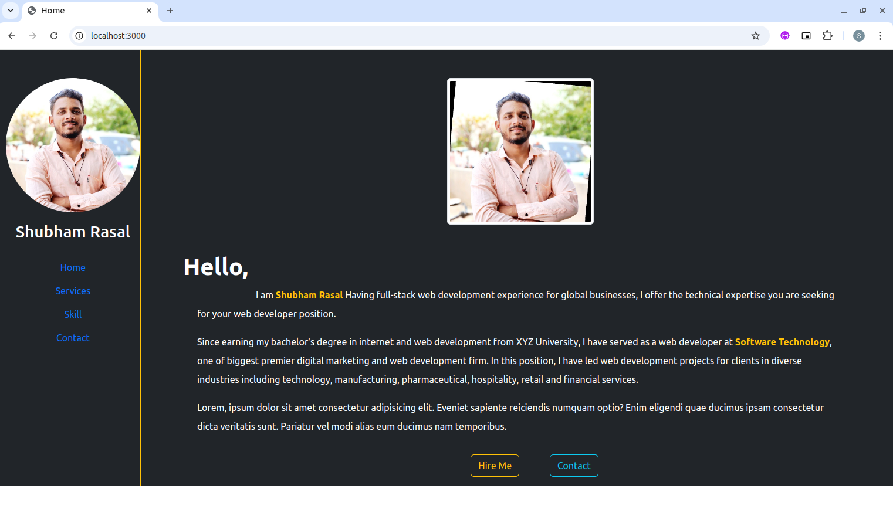
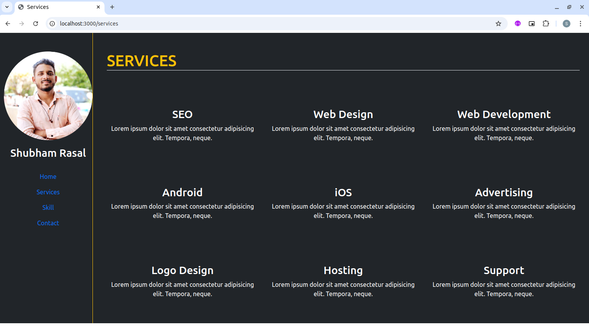
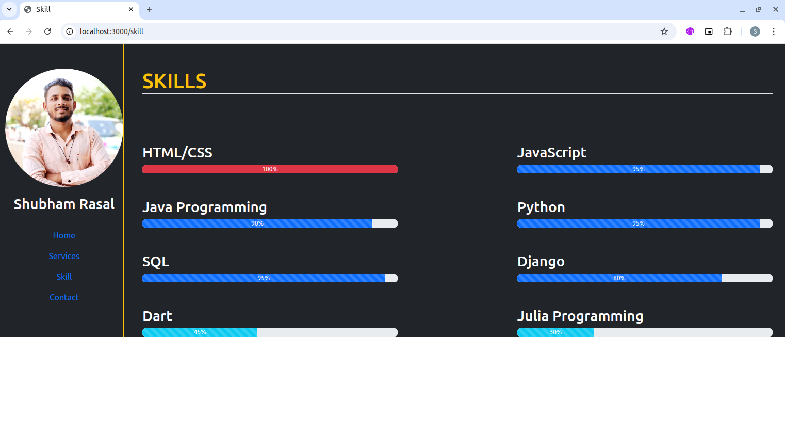
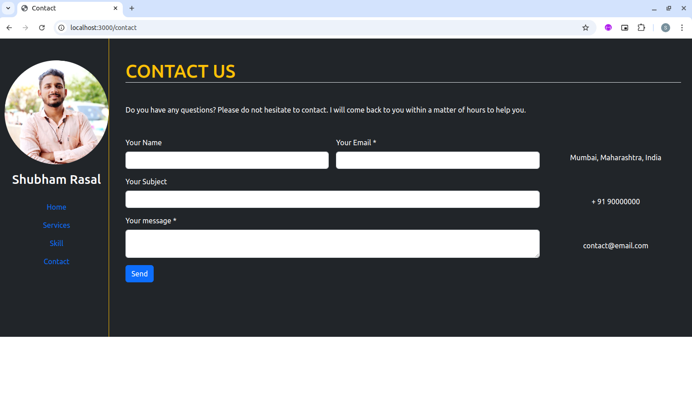

# Interactive Resume Website

## screenshots

This project is an Interactive Resume Website built with [Nodejs](https://nodejs.org/en/download) and [Express](https://expressjs.com/), allowing users to view a dynamically rendered resume. Using [EJS](https://ejs.co/) templating, the website displays sections like personal information, skills, experience, and education in a clean, organized layout. [JavaScript](https://developer.mozilla.org/en-US/docs/Web/JavaScript) enhances interactivity, making the resume responsive and easy to navigate. The setup is managed through [Npm](https://www.npmjs.com/package/download), allowing for streamlined dependencies and project management. This project is ideal for learning server-side rendering, creating dynamic web pages, and showcasing personal achievements in a professional online format.

## ⚙️ Requirements

- [Npm](https://www.npmjs.com/package/download)
- [Express](https://expressjs.com/)
- [Nodejs](https://nodejs.org/en/download)
- [EJS](https://ejs.co/)
- [JavaScript](https://developer.mozilla.org/en-US/docs/Web/JavaScript)

## 🛠 Languages or Frameworks Used

#### Steps to create project and install required module:

#### step 1: Start the project using the following command in your project folder:

  + `npm init`

#### 📥 Step 2: Install the required modules using following command:

  + `npm install express`
  + `npm install ejs`
  + `npm install nodemon`

#### Step 3: Create two folders inside the project directory using the following command:

+ `mkdir views`

#### Step 4: Create another file named app.js inside project directory:

+ `touch app.js`
    
#### Step 5: create folder called Controlllers.

+ `cd controllers`

    +  `contactControllers.ejs`
    +  `homeControllers.ejs`
    +  `servicesControllers.ejs`
    +  `skillControllers.ejs`
    
#### Step 6: Navigate inside views folder and create the following ejs files:

+ `cd views`

    + `touch contact.ejs`
    + `touch home.ejs`
    + `touch services.ejs`
    + `touch skill.ejs`
    
+ `cd partials`

    + `touch footer.ejs`
    + `touch header.ejs`
    + `touch sidebar.ejs`

#### Step 7: Run the following command to ensure all modules are loaded:

+ `npm install`

### 🌟 Steps to run the application -

#### Step 1: Type the following command in terminal of your project directory:

+ `npm run dev` or
+ `npm start`

#### Step 2: Open your web browser and type the following address in the URL bar:

+ `(http://localhost:3000/` or
+  `http://localhost:8000/)`
